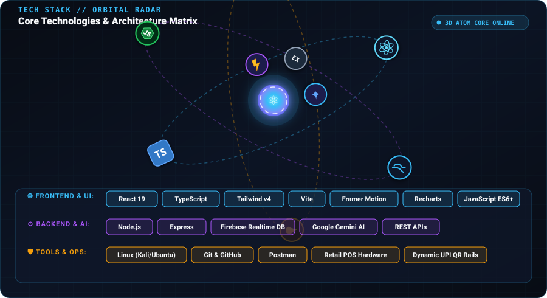

# ⚡ S A R T A J
### 🚀 Full-Stack Web Developer | React 19 & TypeScript Architect | Cybersecurity Specialist

---

<!-- 1. VIDEO HERO (Camera Viewfinder + Animated Character + Cycling Roles) -->

  

<!-- 2 & 3. WHAT I BUILD & HOBBIES CAROUSEL (Dual Panels + Story Progress Bars) -->

  

<!-- 4. TECH ORBIT (Real brand icons orbiting atom core + Chip Grid) -->

  

<!-- 5. ID BADGE + LIVE DASHBOARD (Swinging Holographic Card + Live Stats + Bar Chart) -->

 

---

## 🌟 Featured Engineering Projects

| Project | Description & Architecture | Tech Stack | Links |
| :--- | :--- | :--- | :---: |
| 🏪 **Khurshid General Store ("Roz ka Saaman, Ghar Tak")** | Production-ready Digital Kirana & Retail POS platform. Features real-time stock limits, computerized GST memo invoicing with Hindi currency words converter, dynamic UPI QR generation, 1-click WhatsApp ordering, and multi-device cloud inventory sync. | `React 19` `TypeScript` `Tailwind v4` `Firebase DB` `POS Billing` | [🌐 Live Demo](https://its-sartaj.github.io/ganeralstore/) • [🔗 Repo](https://github.com/its-sartaj/ganeralstore) |
| 🏢 **Apex Tech Digital Agency** | High-performance digital agency platform featuring interactive case studies, consultation modal scheduler, dynamic project filter gallery, and silky-smooth motion interactions. | `React 19` `TypeScript` `Tailwind v4` `Framer Motion` | [🌐 Live Demo](https://its-sartaj.github.io/Apex-Tech/) • [🔗 Repo](https://github.com/its-sartaj/Apex-Tech) |
| 💼 **Sajid Tax Consultant Platform** | Corporate portal for a Mumbai-based financial consultancy. Includes service catalogs, compliance calendar, inquiry callback system, and automated GitHub Actions deployment. | `React 19` `TypeScript` `Tailwind v4` `GitHub Actions` | [🌐 Live Demo](https://its-sartaj.github.io/Sajid_-Tax-Consultant/) • [🔗 Repo](https://github.com/its-sartaj/Sajid_-Tax-Consultant) |
| 🛒 **FreshMart - Grocery & Admin Hub** | Modern e-commerce storefront with instant product search, cart engine, Indian Rupee (₹) checkout, coupon discount validator, and logistics dashboard. | `React 19` `TypeScript` `Tailwind CSS` `Recharts` `Gemini AI` | [🔗 Repo](https://github.com/its-sartaj/Grocery) |
| 🛵 **Indian Delivery Boy Experience** | Gamified interactive hustle anthem experience featuring custom audio engines, motion triggers, and celebratory UI effects. | `React 19` `TypeScript` `Motion` `Canvas-Confetti` | [🔗 Repo](https://github.com/its-sartaj/Delivery-boys) |

 

<!-- 6. 3D CONTRIBUTION CITY (Commits become an isometric night skyline) -->

### 🏙️ 3D Contribution City — Annual Skyline Matrix

<em>Every skyscraper represents daily commit velocity, built into an illuminated cyberpunk skyline.</em>

  

<!-- Live GitHub Analytics -->

 

---

<!-- 7. CONNECT FOOTER (Character pointing at links + Neon handwritten sign) -->

 

 

⭐ *Open for full-time Software Engineering positions, high-impact frontend/full-stack opportunities, and freelance consulting. Feel free to explore my repositories and star projects you like!*

